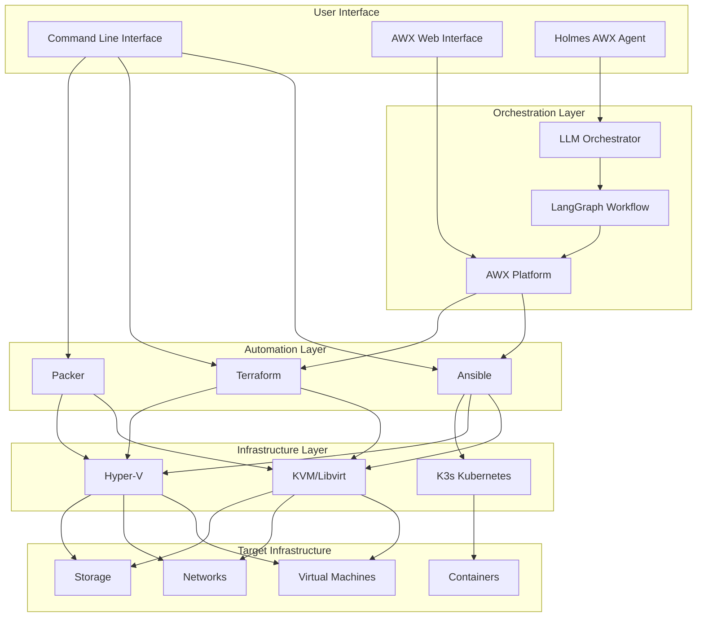
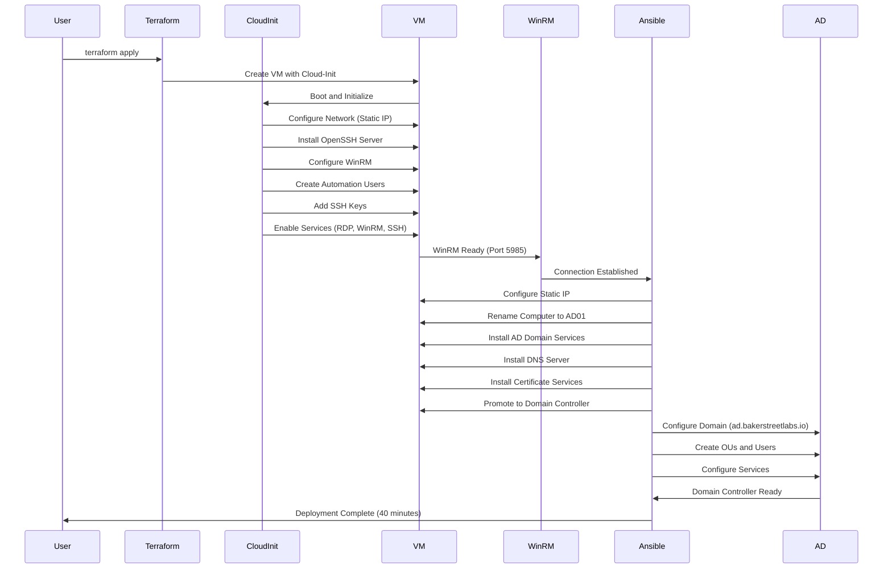
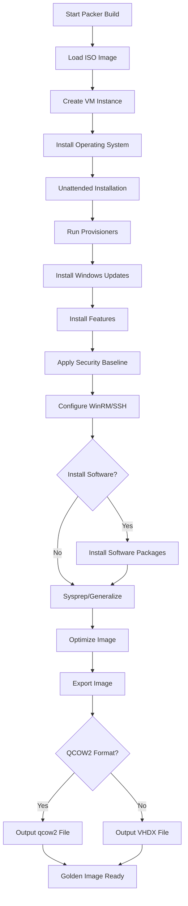
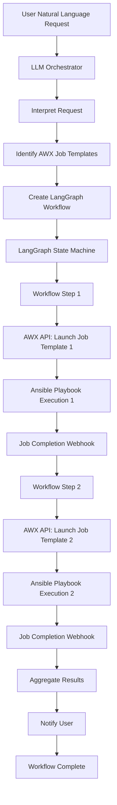
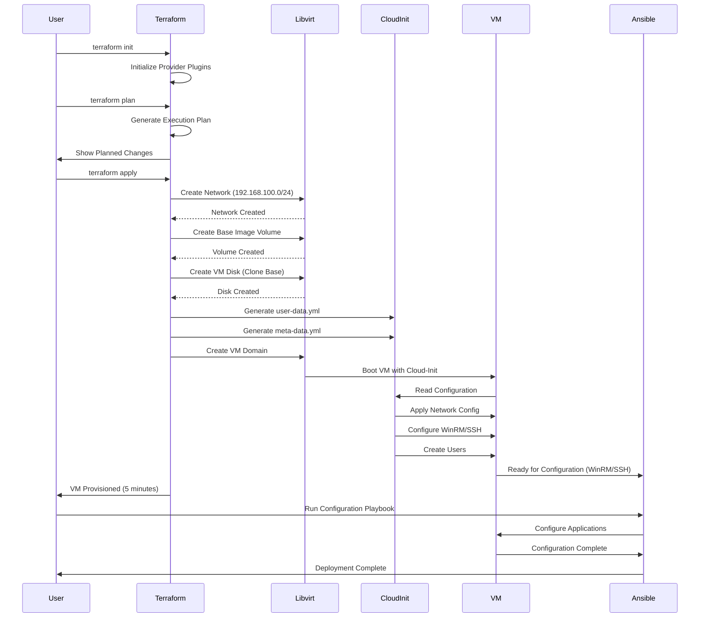
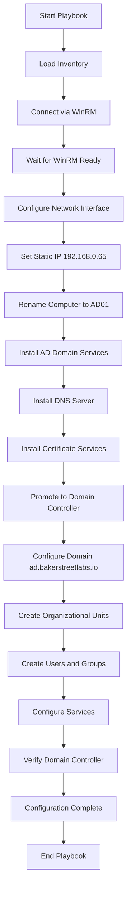
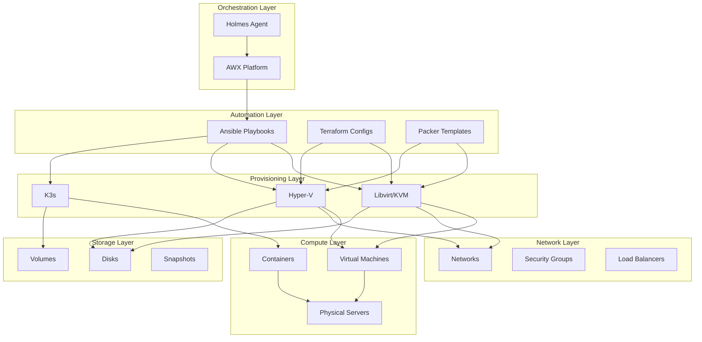
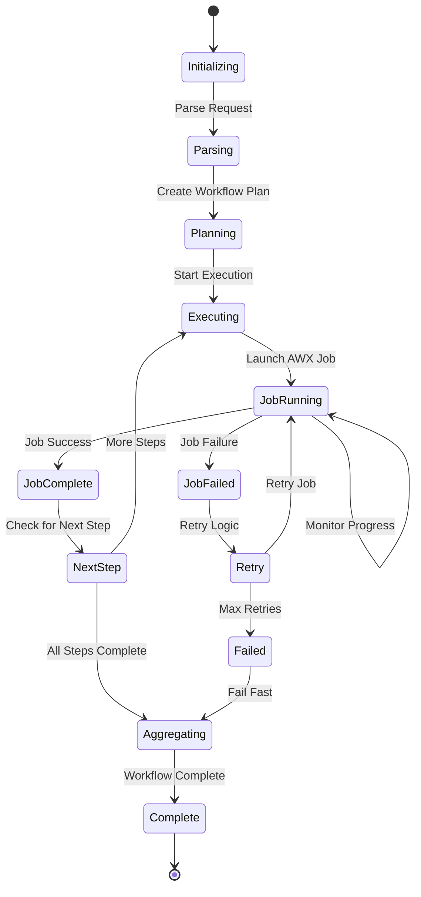
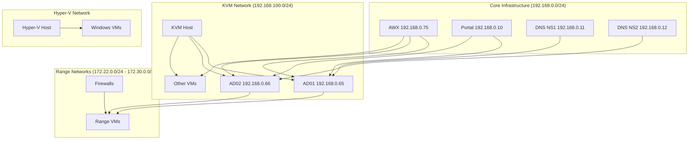

# Infrastructure as Code Design

**Last Updated**: 2026-01-08

---

## System Architecture Diagrams

### Overall IaC Platform Architecture



---

## Zero-Touch AD Deployment Flow

### Truly Headless AD Deployment Sequence



---

## Golden Image Creation Flow

### Packer Image Building Process



---

## AWX Workflow Orchestration

### Holmes AWX Agent Workflow



---

## Terraform Infrastructure Provisioning Flow

### Terraform VM Provisioning Process



---

## Ansible Playbook Execution Flow

### AD Domain Controller Configuration Playbook



---

## AWX Platform Architecture

### AWX Component Interaction

```mermaid
graph TD
    subgraph "Kubernetes Cluster (K3s)"
        subgraph "Namespace: awx"
            AWXWeb[AWX Web<br/>nginx + uwsgi + receptor]
            AWXTask[AWX Task<br/>receptor + ansible-runner]
            AWXOperator[AWX Operator]
        end
        
        subgraph "PostgreSQL"
            PG[(PostgreSQL 15<br/>guacamole_db)]
        end
        
        subgraph "Redis"
            Redis[(Redis<br/>Cache + Message Broker)]
        end
        
        subgraph "Traefik Ingress"
            Traefik[Traefik<br/>HTTPS Termination]
        end
    end

    subgraph "External Services"
        User[User Browser]
        Holmes[Holmes AWX Agent]
        Ansible[Ansible Playbooks]
    end

    User -->|HTTPS| Traefik
    Traefik -->|HTTPS| AWXWeb
    Holmes -->|API| AWXWeb
    AWXWeb --> AWXTask
    AWXTask --> Ansible
    AWXWeb --> PG
    AWXTask --> PG
    AWXWeb --> Redis
    AWXTask --> Redis
    AWXOperator --> AWXWeb
    AWXOperator --> AWXTask
```

---

## Infrastructure Layers

### Multi-Layer Infrastructure Architecture



---

## Workflow State Machine

### LangGraph Workflow State Machine



---

## Network Topology

### Cyber Range Network Architecture



---

**Maintained By**: Baker Street Labs Infrastructure Team

