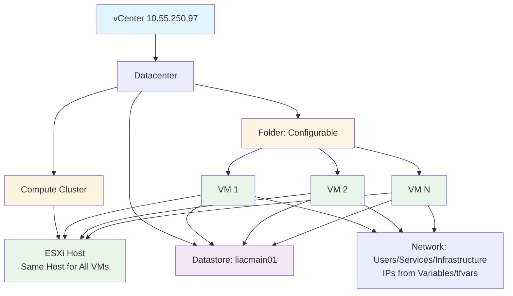
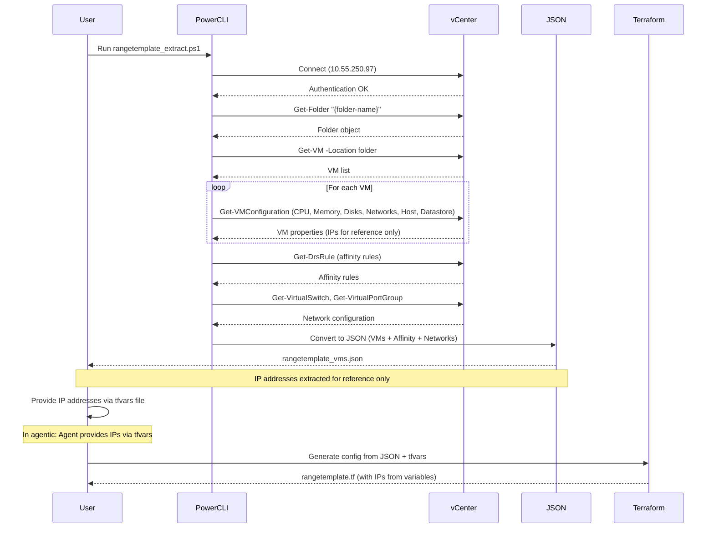
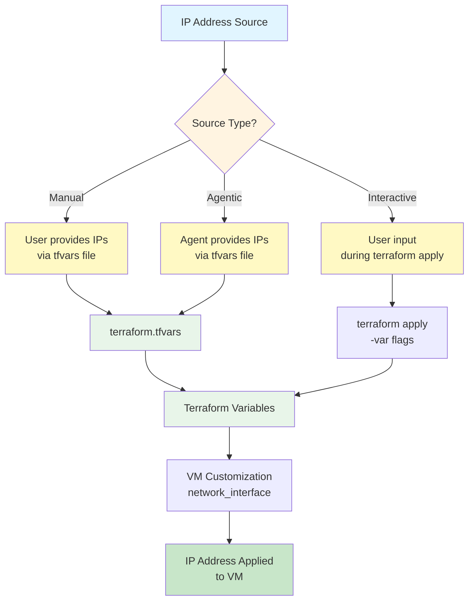

# Range Template Design

**Extracted**: 2026-01-11  
**Source**: vCenter folder template  
**Status**: Mermaid diagrams only (affinity rules and network topology)  
**Last Updated**: 2026-01-11

**NOTE**: IP addresses are NOT hardcoded. They must be provided via Terraform variables (tfvars file) or user input. In agentic situations, the agent should provide IP addresses via tfvars file.

---

## VM Affinity Rule Diagram

```mermaid
graph TD
    A[vCenter Cluster] --> B[DRS Affinity Rule: {folder-name}-vm-affinity]
    B --> C[VM 1]
    B --> D[VM 2]
    B --> E[VM 3]
    B --> F[VM N]
    C --> G[Same ESXi Host]
    D --> G
    E --> G
    F --> G
    G --> H[liacmain01 Datastore]
    
    style A fill:#e1f5ff
    style B fill:#fff4e1
    style G fill:#e8f5e9
    style H fill:#f3e5f5
```

**Description**: All VMs in the template folder are bound by a DRS affinity rule that ensures they run on the same ESXi host. All VMs use the liacmain01 datastore for storage.

---

## Network Topology with VLANs

```mermaid
graph TD
    A[Range Firewall<br/>Configurable IP] --> B[Users Network<br/>Subnet: Variable]
    A --> C[Services Network<br/>Subnet: Variable]
    A --> D[Infrastructure Network<br/>Subnet: Variable]
    
    B --> E[VLAN: Variable<br/>Subnet: Variable]
    C --> F[VLAN: Variable<br/>Subnet: Variable]
    D --> G[VLAN: Variable<br/>Subnet: Variable]
    
    E --> H[{folder-name}-users<br/>Port Group]
    F --> I[{folder-name}-services<br/>Port Group]
    G --> J[{folder-name}-infrastructure<br/>Port Group]
    
    H --> K[VM Network Adapters<br/>Users Network]
    I --> L[VM Network Adapters<br/>Services Network]
    J --> M[VM Network Adapters<br/>Infrastructure Network]
    
    style A fill:#e1f5ff
    style E fill:#fff4e1
    style F fill:#fff4e1
    style G fill:#fff4e1
    style H fill:#e8f5e9
    style I fill:#e8f5e9
    style J fill:#e8f5e9
```

**Description**: Network topology showing three VLANs mapped to Users, Services, and Infrastructure networks. Network subnets, VLANs, and IP addresses are configurable via Terraform variables (tfvars file) or user input. In agentic situations, the agent should provide IP addresses via tfvars file.

---

## VM Hierarchy with Storage



**Description**: VM hierarchy showing all template VMs in the same folder, on the same ESXi host (affinity rule), using the liacmain01 datastore, and connected to configurable networks. IP addresses are provided via Terraform variables (tfvars file) or user input.

---

## Extraction Process Flow



**Description**: Enhanced extraction process that includes VM configuration, affinity rules, and network configuration extraction. IP addresses are extracted for reference only and must be provided via Terraform variables (tfvars file) or user input. In agentic situations, the agent should provide IP addresses via tfvars file.

---

## Deployment Flow with Affinity Rule

```mermaid
graph LR
    A[Extract JSON] --> B[Provide IPs via tfvars]
    Note over B: In agentic: Agent provides IPs
    B --> C[Generate Terraform]
    C --> D[terraform init]
    D --> E[terraform plan -var-file=tfvars]
    E --> F{Plan OK?}
    F -->|Yes| G[terraform apply -var-file=tfvars]
    F -->|No| H[Fix config]
    H --> E
    G --> I[Create VMs]
    I --> J[Create Affinity Rule]
    J --> K[Verify: All VMs on Same Host]
    K --> L[Verify: All VMs on liacmain01]
    L --> M[Verify: Networks Configured]
    M --> N[Verify: IPs from tfvars Applied]
    N --> O[Complete]
    
    style A fill:#e1f5ff
    style B fill:#fff9c4
    style G fill:#e8f5e9
    style J fill:#fff4e1
    style O fill:#c8e6c9
    style H fill:#ffcdd2
```

**Description**: Deployment flow showing the creation of VMs followed by affinity rule creation, then verification of host placement, storage, network configuration, and IP addresses from tfvars file. IP addresses must be provided via tfvars file or user input. In agentic situations, the agent should provide IP addresses via tfvars file.

---

## IP Address Configuration Flowchart



**Description**: IP address configuration flowchart showing how IPs are provided via Terraform variables (tfvars file), user input, or agent input. In agentic situations, the agent should provide IP addresses via tfvars file. IP addresses are NOT hardcoded.

---

## VM Resource Structure with Affinity

```mermaid
graph TD
    A[vsphere_virtual_machine] --> B[Basic Config]
    A --> C[Compute]
    A --> D[Storage]
    A --> E[Network]
    A --> F[Guest OS]
    
    B --> B1[Name]
    B --> B2[Folder: Configurable]
    B --> B3[Tags]
    
    C --> C1[Resource Pool]
    C --> C2[CPU Count]
    C --> C3[Memory MB]
    
    D --> D1[Disk 1]
    D --> D2[Disk 2]
    D --> D3[Disk N]
    D1 --> D1a[Size GB]
    D1 --> D1b[Format]
    D1 --> D1c[Datastore: liacmain01]
    
    E --> E1[Network Adapter: Users<br/>IP from Variable/tfvars]
    E --> E2[Network Adapter: Services<br/>IP from Variable/tfvars]
    E --> E3[Network Adapter: Infrastructure<br/>IP from Variable/tfvars]
    
    F --> F1[Guest ID]
    F --> F2[Customization]
    F2 --> F2a[Computer Name]
    F2 --> F2b[IP Config: From Variable/tfvars]
    F2 --> F2c[DNS Settings: From Variable/tfvars]
    
    G[vsphere_compute_cluster_vm_affinity_rule] --> G1[Name: {folder}-vm-affinity]
    G --> G2[VM IDs: All template VMs]
    G --> G3[Enabled: Configurable]
    G --> G4[Mandatory: Configurable]
    
    style A fill:#e1f5ff
    style C fill:#fff4e1
    style D fill:#e8f5e9
    style E fill:#f3e5f5
    style F fill:#fff9c4
    style G fill:#ffcdd2
```

**Description**: VM resource structure showing all components including the affinity rule resource that ensures all VMs stay on the same host. IP addresses are provided via Terraform variables (tfvars file) or user input. In agentic situations, the agent should provide IP addresses via tfvars file.

---

**Last Updated**: 2026-01-11  
**Status**: Mermaid diagrams for affinity rules and network topology  
**IP Address Configuration**: Variables/tfvars/user input/agent (NOT hardcoded)
